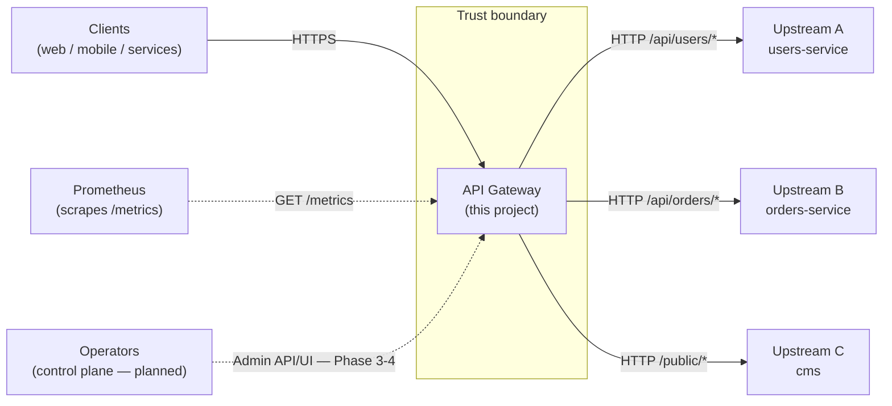
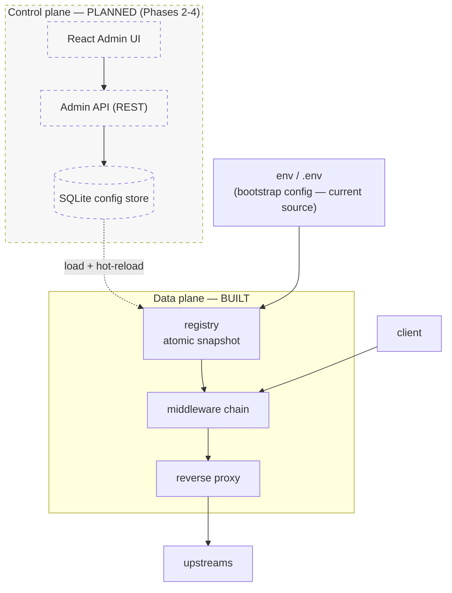
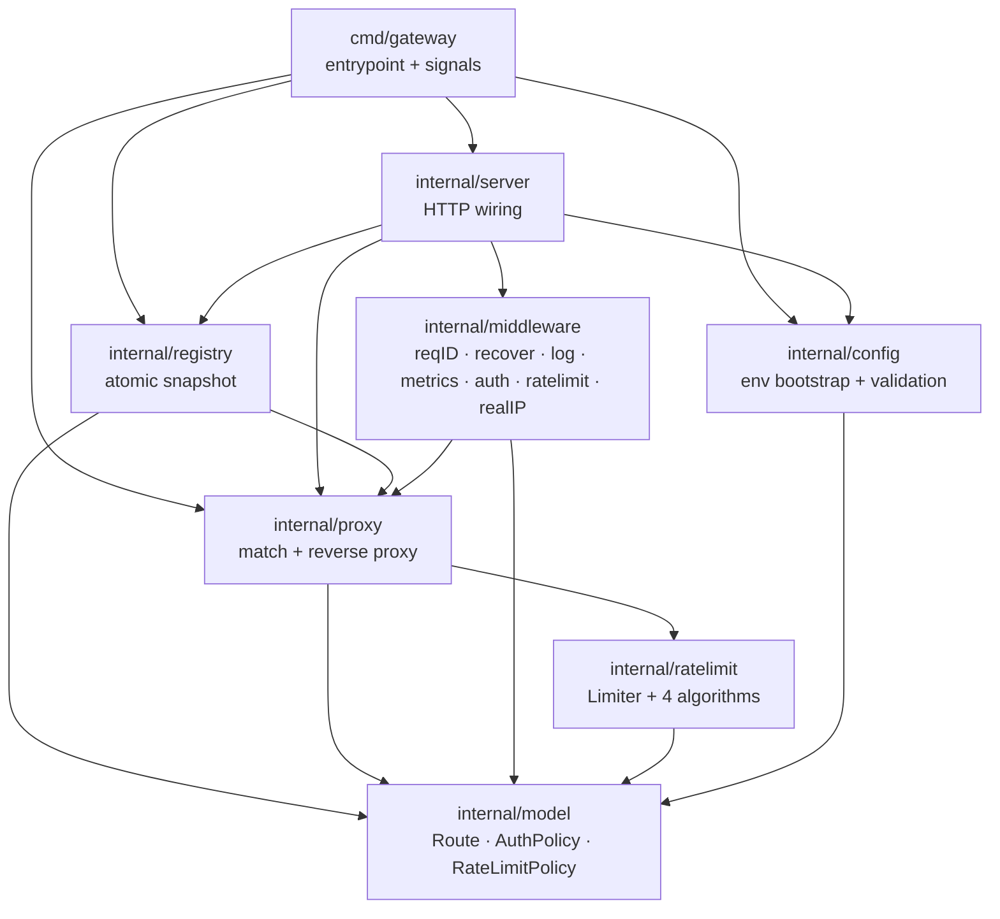
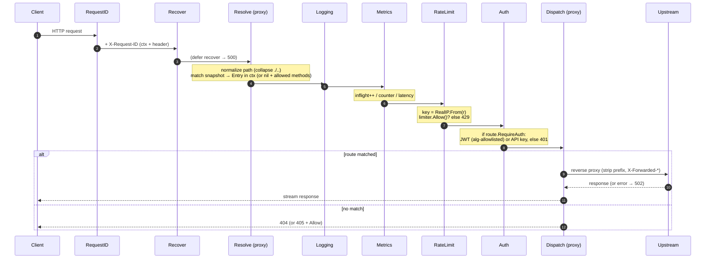
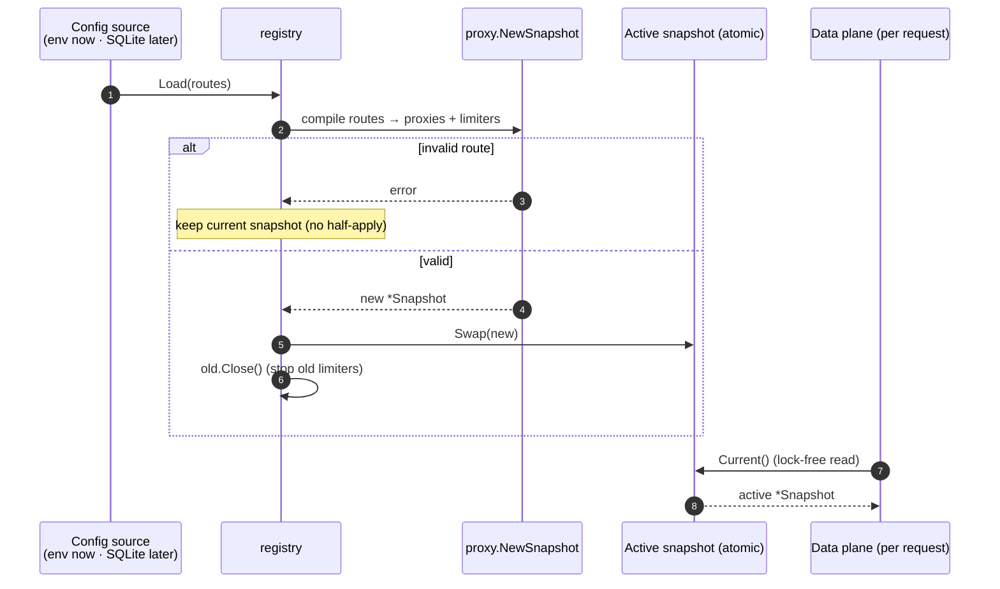
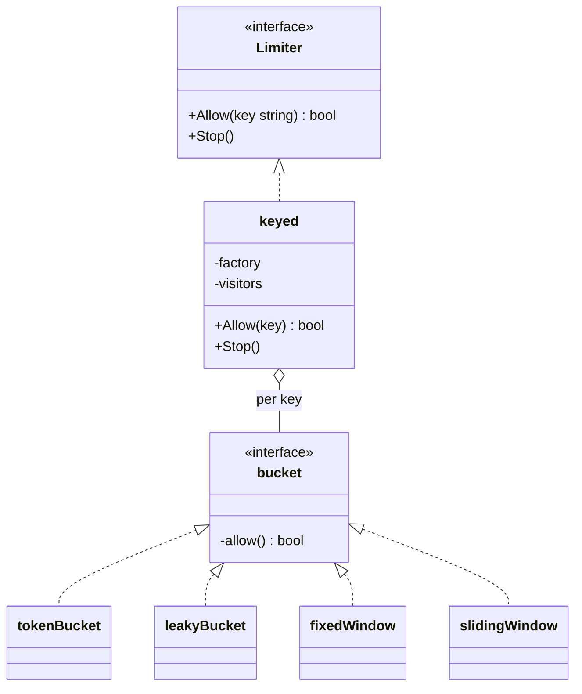
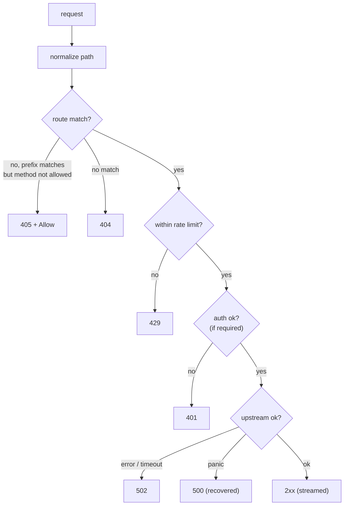
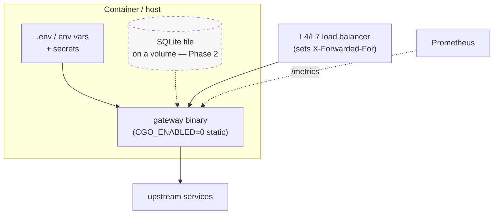
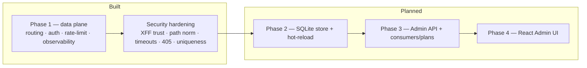

# Application Architecture

Visual companion to the [technical design](./technical-design.md). It documents
the **current implementation** (Phase 1 data plane + security hardening) and
shows where the planned control plane (Phases 2–4) attaches. Diagrams are
Mermaid (rendered inline by GitHub) with ASCII fallbacks where useful.

- [1. System context](#1-system-context)
- [2. Two-plane architecture](#2-two-plane-architecture)
- [3. Module / package map](#3-module--package-map)
- [4. Request lifecycle](#4-request-lifecycle)
- [5. Configuration & hot-reload](#5-configuration--hot-reload)
- [6. Rate-limiting design](#6-rate-limiting-design)
- [7. Outcomes & status codes](#7-outcomes--status-codes)
- [8. Deployment view](#8-deployment-view)
- [9. Current vs planned](#9-current-vs-planned)

---

## 1. System context

Who talks to the gateway and what it fronts.



The gateway is the **single ingress**: clients address one host; the gateway
routes each request to the right upstream by path prefix, applying auth, rate
limiting, and observability at this one choke point.

---

## 2. Two-plane architecture

The system separates a **data plane** (serves live traffic) from a **control
plane** (manages configuration). Today the data plane is built; the control
plane is planned, with the **registry** already the seam between them.



| | Data plane | Control plane |
|---|---|---|
| **Status** | Built | Planned |
| **Job** | Proxy traffic, fast | Manage config |
| **Reads/writes** | reads `registry.Current()` per request | writes store → triggers reload |
| **Listener** | public `:8080` | private `:9000` (planned) |
| **Config source (now)** | env / `.env` → registry | — |

---

## 3. Module / package map

Go packages and their dependencies. `cmd/gateway` wires everything; `internal/*`
holds the logic. Arrows point from a package to what it imports.



`model` is the shared vocabulary every layer agrees on. Note the data plane
(`proxy`) depends only on `model` + `ratelimit` — never on config sources — so
swapping env for SQLite later touches only `config`/`registry`.

---

## 4. Request lifecycle

Order is significant: `Resolve` runs first so logging, metrics, rate-limit and
auth can all read the matched route from context. Unmatched requests still flow
through (logged + metered); `Dispatch` emits the final 404/405.



**RealIP** (used by Logging + RateLimit) resolves the client IP, trusting
`X-Forwarded-For` only from configured trusted proxies — otherwise `RemoteAddr`.

Operational endpoints bypass this chain entirely:

```
GET /healthz  → 200 {"status":"ok"}
GET /metrics  → Prometheus exposition
```

---

## 5. Configuration & hot-reload

The **registry** holds the live config as an immutable snapshot in an
`atomic.Pointer`. Reads are lock-free; updates build a new snapshot and swap it
atomically — the basis for zero-restart hot-reload.



Configuration today is **bootstrap env vars** (loaded from `.env` if present):
listen addr, secrets, routes JSON, rate-limit defaults, trusted proxies, and
upstream timeouts. In Phase 2 the same `Load` path is driven by the SQLite store.

---

## 6. Rate-limiting design

A pluggable `Limiter` interface with four algorithms, selected per route. A
shared `keyed` wrapper owns per-key (per-client-IP) state and idle eviction, so
each algorithm only implements `allow()`.



| Algorithm | Behavior | Params |
|-----------|----------|--------|
| `token_bucket` *(default)* | steady refill + burst | `rps`, `burst` |
| `leaky_bucket` | constant drain, no bursts | `rps`, `burst` |
| `fixed_window` | count per fixed window | `rps`, `window_sec` |
| `sliding_window` | rolling weighted window | `rps`, `window_sec` |

---

## 7. Outcomes & status codes



| Code | When |
|------|------|
| 2xx | proxied upstream response |
| 401 | auth required, missing/invalid credential |
| 404 | no route matches the path |
| 405 | path matches but method not allowed (`Allow` header set) |
| 429 | rate limit exceeded |
| 500 | handler panic (recovered; process survives) |
| 502 | upstream unreachable / timed out |

---

## 8. Deployment view

Single static Go binary; SQLite + admin UI arrive with the control plane.



- **Artifact:** one static binary (pure-Go SQLite keeps `CGO_ENABLED=0`).
- **Behind an LB?** set `GATEWAY_TRUSTED_PROXIES` to the LB network so
  `X-Forwarded-For` is trusted for client-IP resolution; otherwise XFF is ignored.
- **Scaling:** stateless data plane scales horizontally; rate-limit state and
  (Phase 2) SQLite config are per-node until the shared-store roadmap item.

---

## 9. Current vs planned



| Area | Status |
|------|--------|
| Reverse-proxy routing (longest-prefix, strip, methods) | ✅ Built |
| Auth — JWT (HS256/384/512, alg-allowlisted) + API keys | ✅ Built |
| Rate limiting — 4 algorithms, per route | ✅ Built |
| Observability — slog logs, Prometheus, request IDs | ✅ Built |
| Trusted-proxy XFF, path normalization, upstream timeouts | ✅ Built |
| SQLite config store + hot-reload | ⏳ Phase 2 |
| Admin REST API + consumers/plans | ⏳ Phase 3 |
| React admin UI | ⏳ Phase 4 |

See [technical-design.md](./technical-design.md) for the full specification and
[test-findings.md](./test-findings.md) for the adversarial test results.
