# Application Architecture

Visual companion to the [technical design](./technical-design.md). It documents
the **current implementation** (Phase 1 data plane + security hardening) and
shows where the planned control plane (Phases 2–4) attaches. All diagrams are
Mermaid (rendered inline by GitHub).

### Colour legend

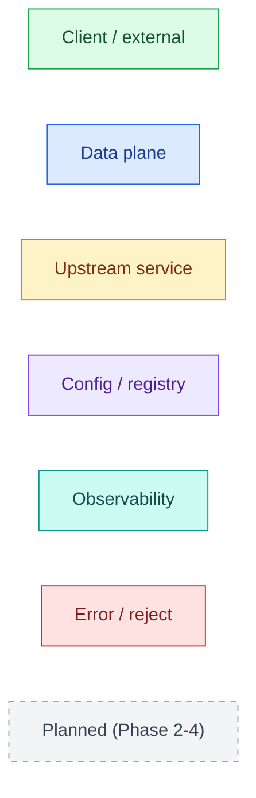

- [1. System context](#1-system-context)
- [2. Two-plane architecture](#2-two-plane-architecture)
- [3. Module / package map](#3-module--package-map)
- [4. Middleware pipeline](#4-middleware-pipeline)
- [5. Request lifecycle (sequence)](#5-request-lifecycle-sequence)
- [6. Authentication decision](#6-authentication-decision)
- [7. Client-IP resolution (trusted proxy)](#7-client-ip-resolution-trusted-proxy)
- [8. Configuration & hot-reload](#8-configuration--hot-reload)
- [9. Snapshot lifecycle](#9-snapshot-lifecycle)
- [10. Rate-limiting design](#10-rate-limiting-design)
- [11. Outcomes & status codes](#11-outcomes--status-codes)
- [12. Deployment view](#12-deployment-view)
- [13. Current vs planned](#13-current-vs-planned)

---

## 1. System context

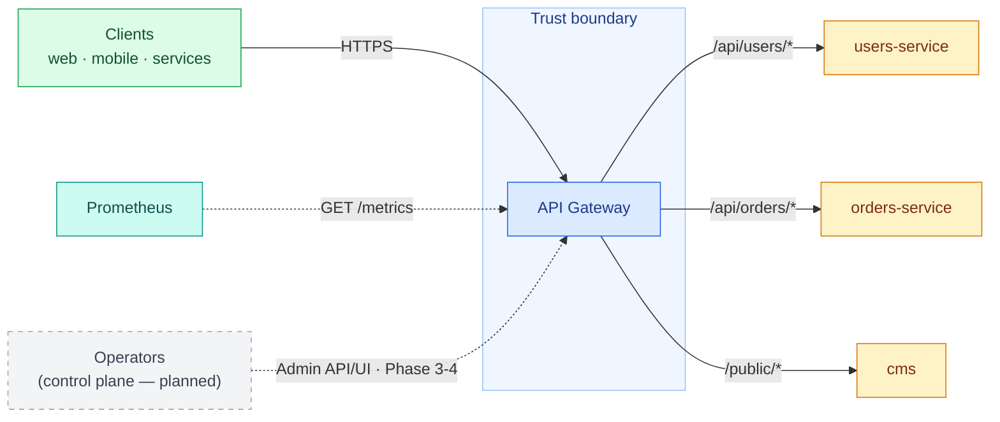

The gateway is the **single ingress**: one host for clients, routing each
request to the right upstream by path prefix while applying auth, rate limiting,
and observability at this one choke point.

---

## 2. Two-plane architecture

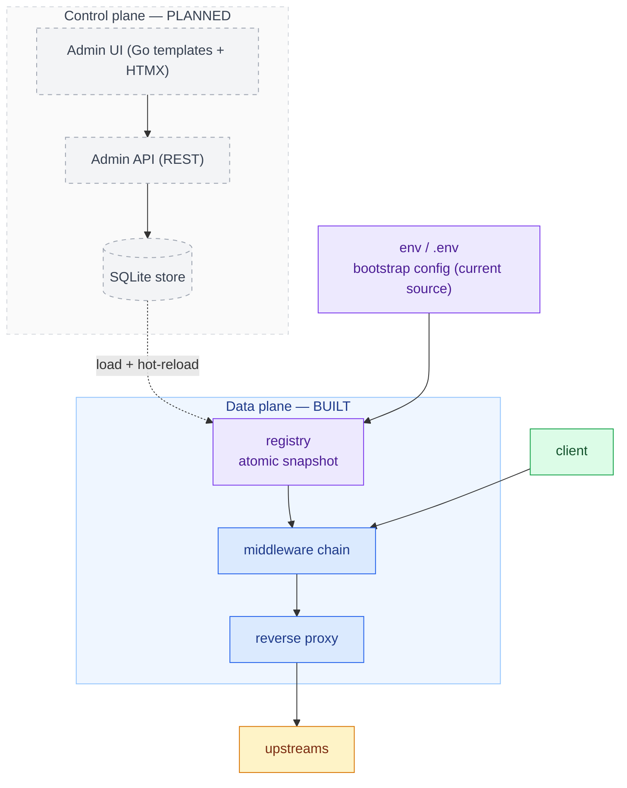

The **registry** is the seam between planes: the data plane reads it lock-free
per request; the config source (env now, SQLite later) writes it.

---

## 3. Module / package map

Arrows point from a package to what it imports. Coloured by role.

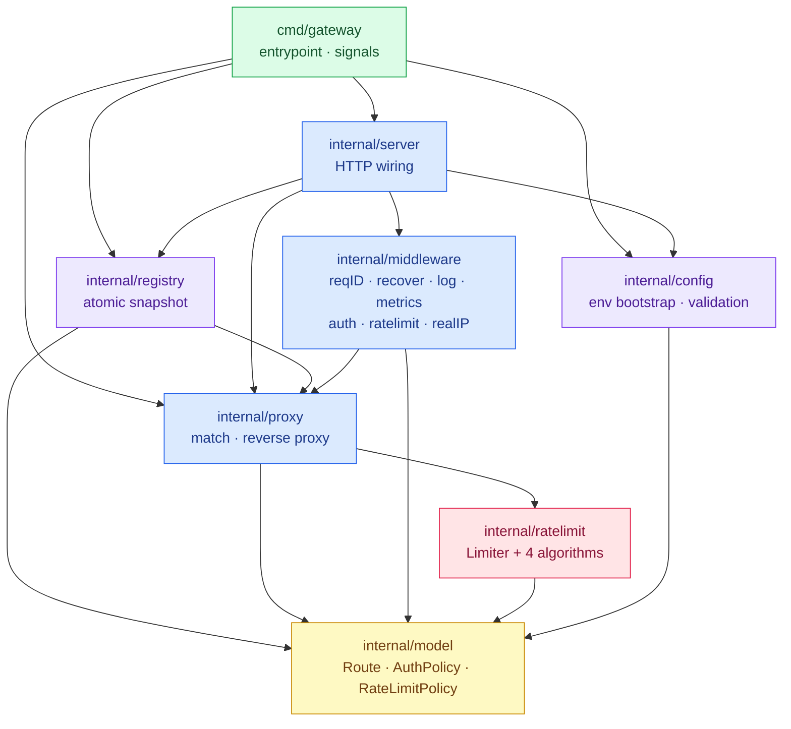

`model` is the shared vocabulary every layer agrees on. The data plane (`proxy`)
depends only on `model` + `ratelimit` — never on config sources — so swapping env
for SQLite later touches only `config`/`registry`.

---

## 4. Middleware pipeline

The chain in order. Each stage can short-circuit with a status; otherwise it
calls the next. `Resolve` runs first so everything downstream can read the
matched route.

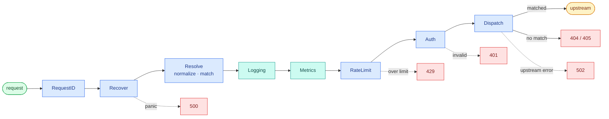

Operational endpoints bypass the chain entirely: `GET /healthz` and
`GET /metrics`.

---

## 5. Request lifecycle (sequence)

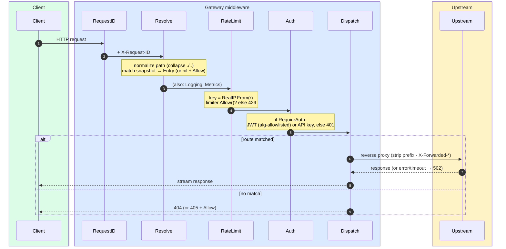

---

## 6. Authentication decision

Only routes with `RequireAuth` are gated. A request passes if **any** accepted
credential validates.

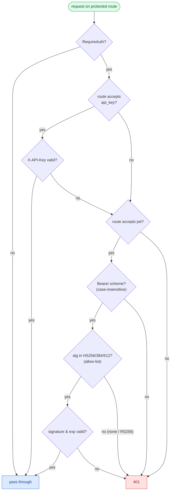

The `alg` allow-list is what defeats `alg=none` and RS→HS confusion attacks.

---

## 7. Client-IP resolution (trusted proxy)

`RealIP` decides the identity used for rate limiting and logging. The secure
default ignores `X-Forwarded-For`, so a client can't spoof it to evade limits.

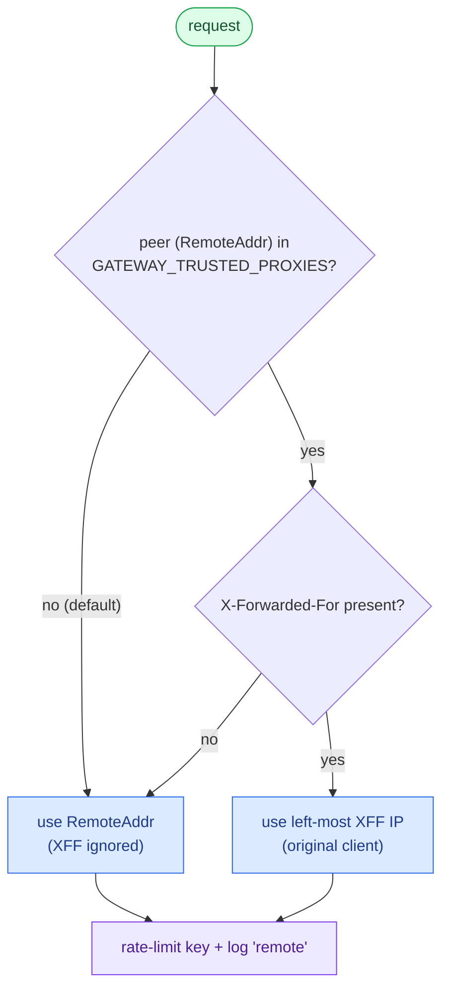

---

## 8. Configuration & hot-reload

The registry holds the live config as an immutable snapshot in an
`atomic.Pointer`. Reads are lock-free; updates build a new snapshot and swap it
atomically.

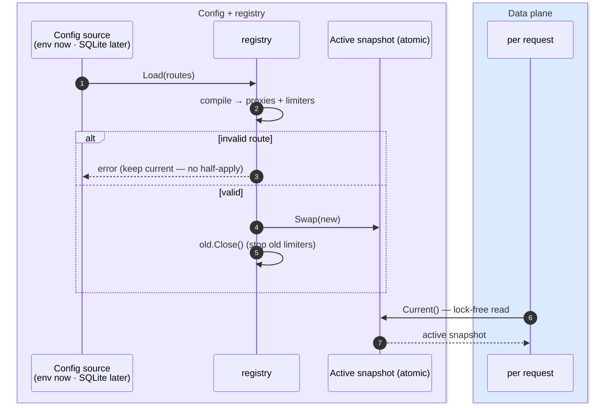

---

## 9. Snapshot lifecycle

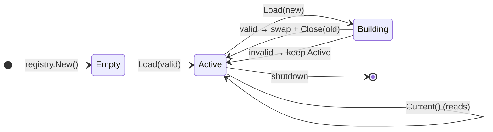

A reload is all-or-nothing: the new snapshot is built and validated fully before
the atomic swap, so a bad edit never half-applies and in-flight requests finish
on the snapshot they started with.

---

## 10. Rate-limiting design

A pluggable `Limiter` with four algorithms, chosen per route. A shared `keyed`
wrapper owns per-client-IP state and idle eviction; each algorithm only
implements `allow()`.

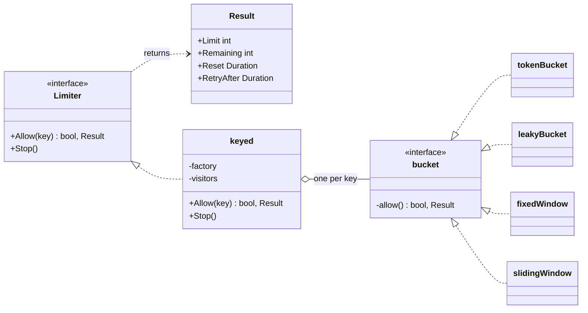

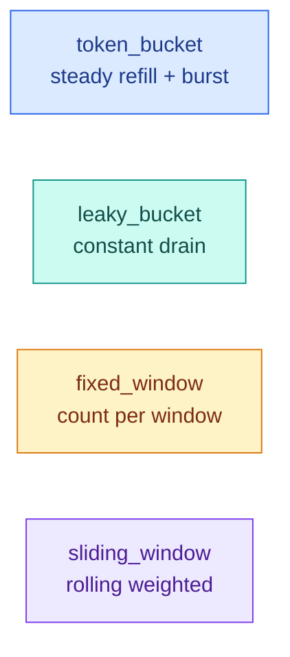

| Algorithm | Behavior | Params |
|-----------|----------|--------|
| `token_bucket` *(default)* | steady refill + burst | `rps`, `burst` |
| `leaky_bucket` | constant drain, no bursts | `rps`, `burst` |
| `fixed_window` | count per fixed window | `rps`, `window_sec` |
| `sliding_window` | rolling weighted window | `rps`, `window_sec` |

### Consumption headers

Each `Allow` returns a `Result` (limit, remaining, reset, retry-after) computed
from the route's configured limit. The middleware surfaces it so clients can see
their consumption and when capacity returns.

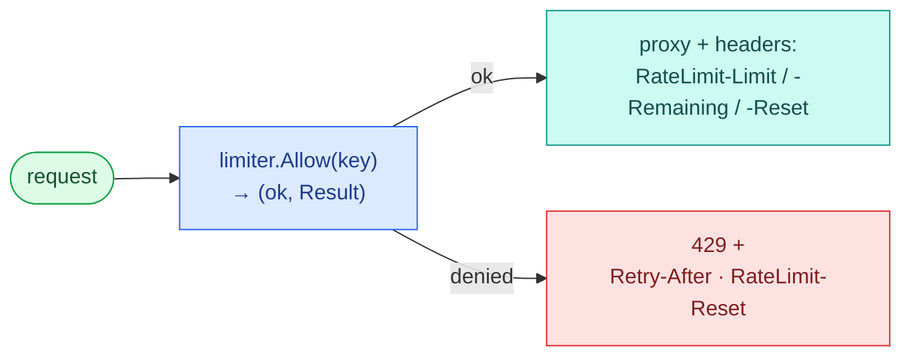

| Header | Meaning |
|--------|---------|
| `RateLimit-Limit` (+ `X-RateLimit-Limit`) | configured allowance (burst / per-window limit) |
| `RateLimit-Remaining` (+ `X-`) | allowance left for this client |
| `RateLimit-Reset` (+ `X-`) | seconds until the allowance replenishes |
| `Retry-After` | on `429` only — seconds to wait before retrying |

---

## 11. Outcomes & status codes

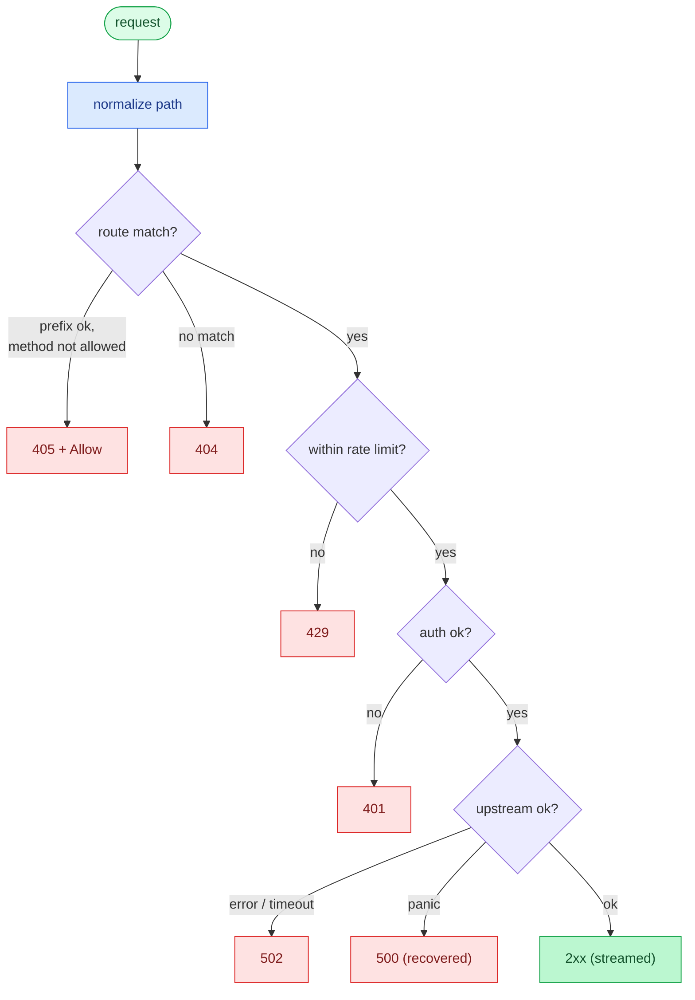

---

## 12. Deployment view

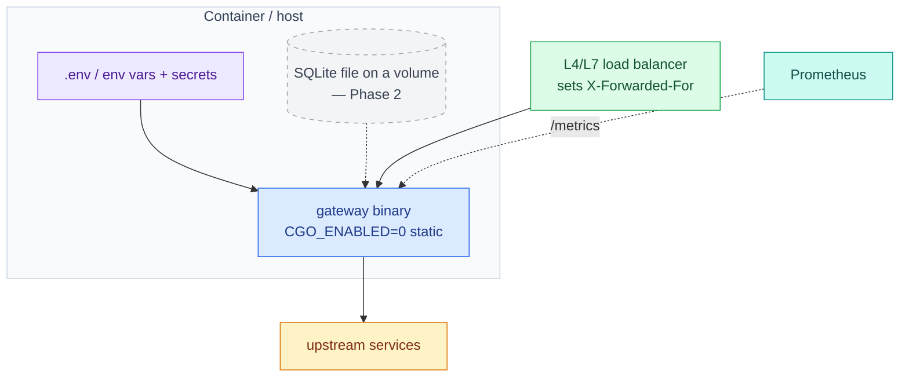

- **Artifact:** one static binary (pure-Go SQLite keeps `CGO_ENABLED=0`).
- **Behind an LB?** set `GATEWAY_TRUSTED_PROXIES` to the LB network so XFF is
  trusted; otherwise XFF is ignored and every client looks like the LB.
- **Scaling:** stateless data plane scales horizontally; rate-limit state and
  (Phase 2) SQLite config are per-node until the shared-store roadmap item.

---

## 13. Current vs planned

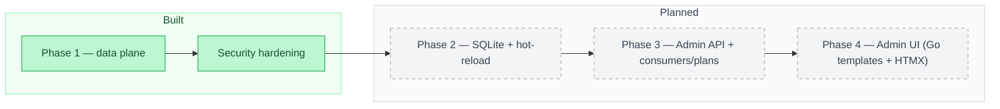

| Area | Status |
|------|--------|
| Reverse-proxy routing (longest-prefix · strip · methods) | ✅ Built |
| Auth — JWT (HS256/384/512, alg-allowlisted) + API keys | ✅ Built |
| Rate limiting — 4 algorithms, per route | ✅ Built |
| Observability — slog logs · Prometheus · request IDs | ✅ Built |
| Trusted-proxy XFF · path normalization · upstream timeouts | ✅ Built |
| SQLite config store + hot-reload | ⏳ Phase 2 |
| Admin REST API + consumers/plans | ⏳ Phase 3 |
| Admin UI — Go html/template + HTMX | ⏳ Phase 4 |

See [technical-design.md](./technical-design.md) for the full specification and
[test-findings.md](./test-findings.md) for the adversarial test results.
